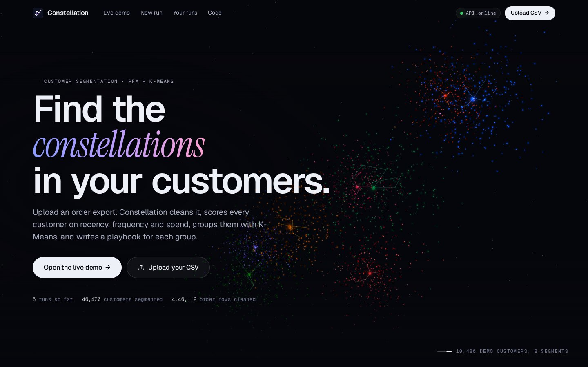
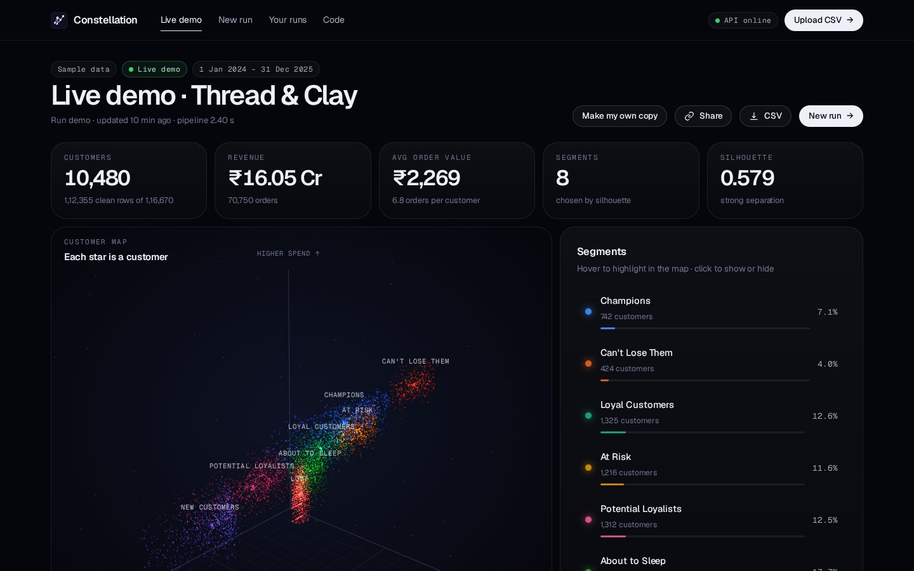
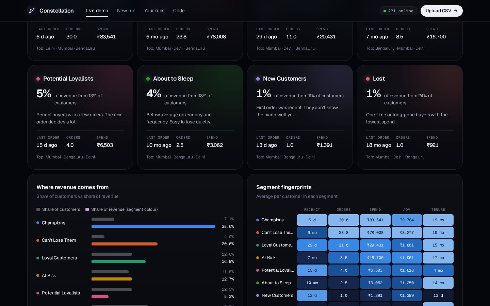
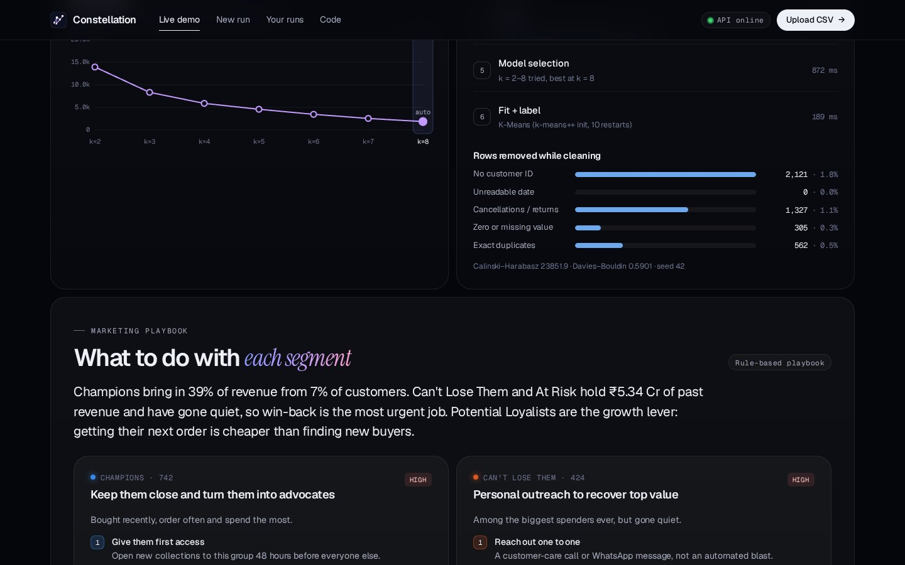
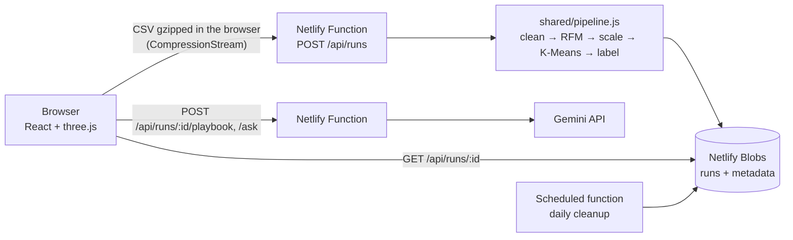

# Constellation

**Customer segmentation for online stores.** Upload an order export and Constellation cleans it, scores every customer on recency, frequency and spend (RFM), groups them with K-Means, draws them as a 3D map, and writes a marketing playbook for each segment with Gemini.

**Live demo:** https://constellation-nishant.netlify.app &nbsp;·&nbsp; **Author:** [Nishant Singh](https://nishant-singhaa0240274.netlify.app)





## What it does

- **Cleans messy exports.** Drops guest checkouts, cancellations and returns, zero-value lines and exact duplicates, and reports how many rows each rule removed.
- **Detects columns automatically.** Works with Shopify order exports, the UCI Online Retail I and II datasets, or any CSV with a customer, a date and an amount (or quantity × price). Handles `₹1,299.00`-style amounts, day-first and month-first dates, and Excel serial dates.
- **Picks k for you.** Fits K-Means for k = 2 to 8 and chooses the best silhouette score (k ≥ 3). The dashboard shows silhouette and inertia for every k, and the run's owner can click any k to re-fit instantly.
- **Names each segment** (Champions, At Risk, Can't Lose Them, New Customers…) by matching each cluster's average RFM quintile scores to 11 standard RFM archetypes with an exact assignment, so no two clusters get the same name.
- **3D customer map** in three.js: every customer is a point, placed by frequency, spend and recency. Hover for details, click to find the customer in the table, hover a segment to isolate it.
- **AI playbook and Q&A** with the Gemini API: three actions, an offer, a KPI and a sample message per segment, plus free-form questions answered only from the run's numbers. Without an API key, a rule-based playbook is used, so the app always works.
- **Saved runs.** Runs are stored in Netlify Blobs with shareable links. Only the browser that created a run can re-fit or delete it (owner token, stored as a SHA-256 hash). Uploads are deleted automatically after 30 days by a scheduled function.
- **Export** every customer with their segment as CSV.





## Architecture



| Layer | Technology |
|---|---|
| Frontend | React 18, Vite, React Router, Framer Motion, three.js (custom GLSL point shader) |
| Backend | Netlify Functions (Node 22, ES modules), 7 HTTP endpoints + 1 scheduled job |
| Database | Netlify Blobs (key-value store, strong consistency) |
| ML | K-Means (k-means++ init, 10 restarts), silhouette / Calinski–Harabasz / Davies–Bouldin, written in JavaScript; reference version in Python with pandas and scikit-learn |
| AI | Gemini API via REST with JSON-schema output, model fallback chain, per-IP rate limit |

## The model

1. **Clean.** Remove rows with no customer ID, unreadable dates, cancellations (`C` invoice prefix or negative quantity), zero or missing values, and exact duplicate rows.
2. **RFM features.** One row per customer: recency = days from the last order to the day after the dataset ends; frequency = distinct orders; monetary = total spend. Tenure and average order value are kept for profiling.
3. **Scale.** `log1p` for the long tails, winsorise at the 0.5th and 99.5th percentiles, then z-score.
4. **Model selection.** K-Means for k = 2 to 8. Silhouette is computed on a fixed 2,000-customer sample (as scikit-learn's `sample_size` does), and the best k ≥ 3 is chosen.
5. **Label.** Each customer gets 1–5 quintile scores for R, F and M. Each cluster's mean scores are matched to archetype prototypes, minimising total squared distance over all assignments (dynamic programming over subsets).

### Checked against scikit-learn

The model is implemented twice: `python/pipeline.py` (pandas + scikit-learn) and `shared/pipeline.js` (production, runs in Netlify Functions). `npm run parity` runs both on the demo data and compares them:

| Check | Result |
|---|---|
| Rows dropped by each cleaning rule | identical |
| Customers and their R, F, M values | identical (10,480 customers, max difference 0) |
| Inertia for k = 2…8 | within 0.03% |
| Silhouette for k = 2…8 | within 0.014 (both sampled) |
| Chosen k | 8 in both |
| Cluster agreement (adjusted Rand index) | 1.000 at k = 8, 0.996 at k = 5 |

On the demo data, the model recovers all eight behaviour patterns the generator used, with 98.5% of customers matched.

### Demo data

`shared/sample.js` generates two years of orders (Jan 2024 – Dec 2025) for **Thread & Clay**, a made-up Indian home-decor brand: 10,480 customers and 116,670 line items in the UCI Online Retail II column layout, including guest checkouts, cancellations, free samples and duplicated rows. It's seeded, so every run is reproducible. You can download it from the app.

## API

| Method | Path | What it does |
|---|---|---|
| `POST` | `/api/runs` | Start a run. JSON `{ "source": "sample", "k": "auto" }`, or multipart form data with `file` (CSV, optionally gzipped) and `meta` (`{ gzip, filename, mapping, dateOrder, k, currency, context }`). Returns the run and an owner token. |
| `GET` | `/api/runs?ids=a,b` | Summaries for the given run IDs |
| `GET` | `/api/runs/:id` | Full run (`demo` is created on first request) |
| `DELETE` | `/api/runs/:id` | Delete (owner only, `x-owner-token` header) |
| `POST` | `/api/runs/:id/recluster` | Re-fit with `{ "k": 5 }` (owner only) |
| `POST` | `/api/runs/:id/playbook` | Write the AI playbook `{ "context": "..." }` |
| `POST` | `/api/runs/:id/ask` | Ask a question `{ "question": "..." }` |
| `GET` | `/api/runs/:id/export` | CSV of every customer with their segment |
| `GET` | `/api/health` | Status, AI on/off, running totals |

Errors come back as `{ "error": "message" }`. Status codes: 400 bad input, 401 not the run's owner, 410 run expired or deleted, 413 too large, 422 file can't be segmented, 429 AI rate limit, 503 AI not configured.

## Run it locally

Needs Node 20+ (Python 3.10+ only for the parity check).

```bash
npm install
npm install -g netlify-cli
netlify dev            # app + functions + local Blobs at http://localhost:8888
```

Optional, for the AI features: create a `.env` file with `GEMINI_API_KEY=your-key`.

```bash
npm test               # pipeline smoke test on the demo data
pip install -r python/requirements.txt
npm run parity         # JS vs scikit-learn comparison
```

## Deploy to Netlify (free plan)

1. Push this folder to a new GitHub repository named `constellation`.
2. In Netlify: **Add new project → Import an existing project → GitHub**, then pick the repository. The build settings are read from `netlify.toml` (build `npm run build`, publish `dist`, functions in `netlify/functions`).
3. Under **Project configuration → Environment variables**, add `GEMINI_API_KEY` (free key from [Google AI Studio](https://aistudio.google.com/apikey)). Optional: `GEMINI_MODEL` to pick a specific model.
4. Deploy. Netlify Blobs needs no setup.
5. Rename the site under **Project configuration → General → Project name** (for example `constellation-nishant`).

## Limits

- Uploads: about 4 MB after gzip (roughly 25–35 MB of CSV), 600,000 rows, 100,000 customers.
- AI: 20 requests per hour per IP and 400 per day across the site, so a public demo can't use up the API key.
- Runs expire after 30 days (the demo run is kept).

## Project structure

```
shared/            code used by both the browser and the functions
  pipeline.js      clean, RFM, scaling, model selection, labelling
  kmeans.js        k-means++, Lloyd iterations, silhouette, CH, DB
  segments.js      RFM archetypes and the rule-based playbook
  ingest.js        column detection, date and number parsing
  sample.js        seeded demo-data generator
netlify/functions  API endpoints and the scheduled cleanup job
netlify/lib        storage, Gemini client, prompts, HTTP helpers
src/               React app (pages, components, three.js map)
python/            pandas + scikit-learn reference and parity check
scripts/           smoke test and parity export
```

## License

MIT © Nishant Singh
